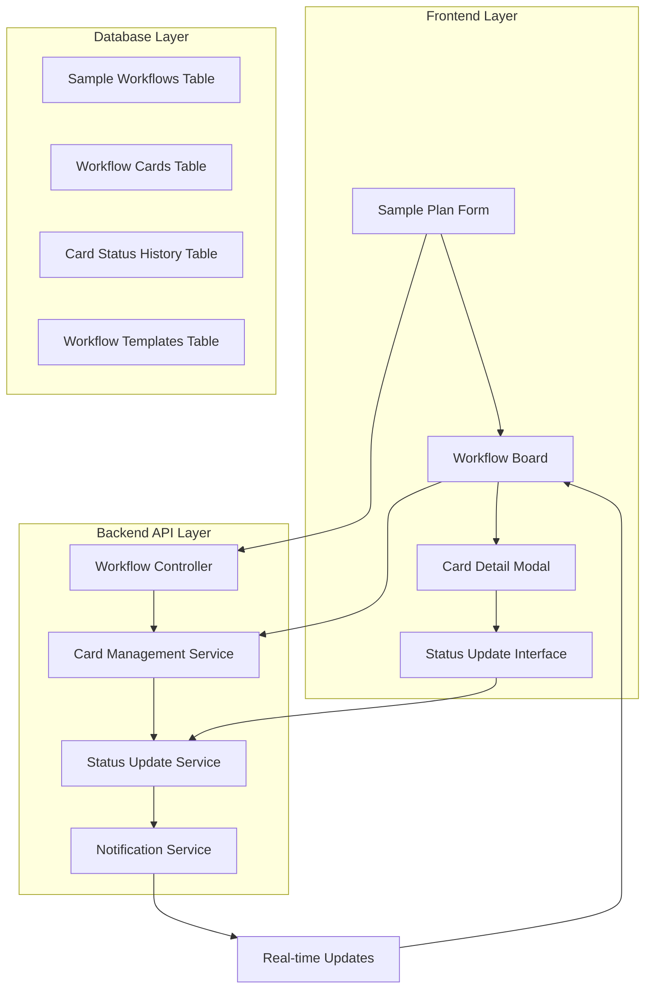
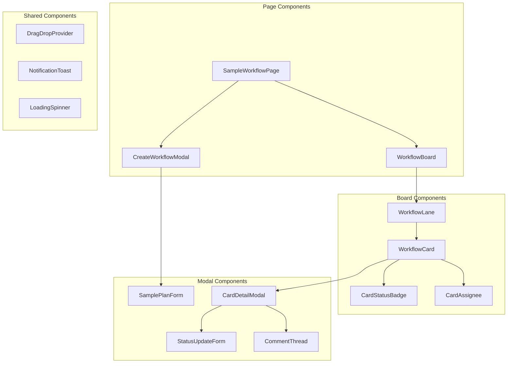

# Design Document

## Overview

This document outlines the design for transforming the existing sample plan system into a modern ClickUp-style card-based workflow management system. The solution provides visual workflow tracking, automated card generation, and role-based status updates for sample development processes.

The system will replace the current table-based sample plan interface with an interactive card board that automatically generates workflow cards when a sample plan is created, enabling teams to track progress through predefined stages with visual feedback and real-time updates.

## Architecture

### System Architecture

The system follows a modular architecture with clear separation between frontend presentation, backend API services, and database persistence layers:



### Component Architecture

The frontend uses a component-based architecture with React and TypeScript:



## Components and Interfaces

### Database Schema

#### Workflow Tables

**sample_workflows**
```sql
CREATE TABLE sample_workflows (
    id SERIAL PRIMARY KEY,
    sample_request_id INTEGER NOT NULL REFERENCES sample_requests(id),
    workflow_name VARCHAR(255) NOT NULL,
    workflow_status VARCHAR(50) DEFAULT 'active',
    created_by VARCHAR(100),
    created_at TIMESTAMP DEFAULT NOW(),
    updated_at TIMESTAMP DEFAULT NOW(),
    completed_at TIMESTAMP NULL,
    priority VARCHAR(20) DEFAULT 'medium',
    due_date TIMESTAMP NULL
);
```

**workflow_cards**
```sql
CREATE TABLE workflow_cards (
    id SERIAL PRIMARY KEY,
    workflow_id INTEGER NOT NULL REFERENCES sample_workflows(id) ON DELETE CASCADE,
    stage_name VARCHAR(100) NOT NULL,
    stage_order INTEGER NOT NULL,
    card_title VARCHAR(255) NOT NULL,
    card_description TEXT,
    assigned_to VARCHAR(100),
    card_status VARCHAR(50) DEFAULT 'pending',
    due_date TIMESTAMP NULL,
    created_at TIMESTAMP DEFAULT NOW(),
    updated_at TIMESTAMP DEFAULT NOW(),
    completed_at TIMESTAMP NULL,
    blocked_reason TEXT NULL
);
```

**card_status_history**
```sql
CREATE TABLE card_status_history (
    id SERIAL PRIMARY KEY,
    card_id INTEGER NOT NULL REFERENCES workflow_cards(id) ON DELETE CASCADE,
    previous_status VARCHAR(50),
    new_status VARCHAR(50) NOT NULL,
    updated_by VARCHAR(100) NOT NULL,
    update_reason TEXT,
    created_at TIMESTAMP DEFAULT NOW()
);
```

**workflow_templates**
```sql
CREATE TABLE workflow_templates (
    id SERIAL PRIMARY KEY,
    template_name VARCHAR(100) NOT NULL,
    stage_name VARCHAR(100) NOT NULL,
    stage_order INTEGER NOT NULL,
    stage_description TEXT,
    default_assignee_role VARCHAR(50),
    estimated_duration_hours INTEGER,
    is_active BOOLEAN DEFAULT true,
    created_at TIMESTAMP DEFAULT NOW()
);
```

#### Card Comments and Attachments

**card_comments**
```sql
CREATE TABLE card_comments (
    id SERIAL PRIMARY KEY,
    card_id INTEGER NOT NULL REFERENCES workflow_cards(id) ON DELETE CASCADE,
    comment_text TEXT NOT NULL,
    commented_by VARCHAR(100) NOT NULL,
    created_at TIMESTAMP DEFAULT NOW(),
    updated_at TIMESTAMP DEFAULT NOW()
);
```

**card_attachments**
```sql
CREATE TABLE card_attachments (
    id SERIAL PRIMARY KEY,
    card_id INTEGER NOT NULL REFERENCES workflow_cards(id) ON DELETE CASCADE,
    file_name VARCHAR(255) NOT NULL,
    file_url VARCHAR(500) NOT NULL,
    file_size INTEGER,
    uploaded_by VARCHAR(100) NOT NULL,
    created_at TIMESTAMP DEFAULT NOW()
);
```

### API Interfaces

#### Workflow Management API

```typescript
interface WorkflowAPI {
  // Workflow CRUD
  createWorkflow(data: CreateWorkflowRequest): Promise<WorkflowResponse>
  getWorkflows(filters?: WorkflowFilters): Promise<WorkflowResponse[]>
  getWorkflow(id: number): Promise<WorkflowResponse>
  updateWorkflow(id: number, data: UpdateWorkflowRequest): Promise<WorkflowResponse>
  deleteWorkflow(id: number): Promise<void>
  
  // Card Management
  getWorkflowCards(workflowId: number): Promise<CardResponse[]>
  updateCardStatus(cardId: number, status: CardStatus, reason?: string): Promise<CardResponse>
  updateCardAssignee(cardId: number, assignee: string): Promise<CardResponse>
  
  // Comments and Attachments
  addCardComment(cardId: number, comment: string): Promise<CommentResponse>
  uploadCardAttachment(cardId: number, file: File): Promise<AttachmentResponse>
}
```

#### Data Transfer Objects

```typescript
interface CreateWorkflowRequest {
  sampleRequestId: number
  workflowName: string
  assignedDesigner?: string
  assignedProgrammer?: string
  assignedSupervisorKnitting?: string
  assignedSupervisorFinishing?: string
  requiredKnittingMachineId?: number
  deliveryPlanDate?: string
  priority?: 'low' | 'medium' | 'high'
}

interface WorkflowResponse {
  id: number
  sampleRequestId: number
  workflowName: string
  workflowStatus: 'active' | 'completed' | 'cancelled'
  createdBy: string
  createdAt: string
  updatedAt: string
  completedAt?: string
  priority: string
  dueDate?: string
  cards: CardResponse[]
  sampleRequest: {
    sampleId: string
    sampleName: string
    buyerName: string
  }
}

interface CardResponse {
  id: number
  workflowId: number
  stageName: string
  stageOrder: number
  cardTitle: string
  cardDescription?: string
  assignedTo?: string
  cardStatus: 'pending' | 'ready' | 'in_progress' | 'completed' | 'blocked'
  dueDate?: string
  createdAt: string
  updatedAt: string
  completedAt?: string
  blockedReason?: string
  comments: CommentResponse[]
  attachments: AttachmentResponse[]
}
```

### Frontend Components

#### Main Workflow Board Component

```typescript
interface WorkflowBoardProps {
  workflows: WorkflowResponse[]
  onCardUpdate: (cardId: number, updates: Partial<CardResponse>) => void
  onWorkflowCreate: (data: CreateWorkflowRequest) => void
}

const WorkflowBoard: React.FC<WorkflowBoardProps> = ({
  workflows,
  onCardUpdate,
  onWorkflowCreate
}) => {
  const [selectedCard, setSelectedCard] = useState<CardResponse | null>(null)
  const [isCreateModalOpen, setIsCreateModalOpen] = useState(false)
  
  return (
    <div className="workflow-board">
      <BoardHeader onCreateClick={() => setIsCreateModalOpen(true)} />
      <div className="workflow-lanes">
        {workflows.map(workflow => (
          <WorkflowLane
            key={workflow.id}
            workflow={workflow}
            onCardClick={setSelectedCard}
            onCardUpdate={onCardUpdate}
          />
        ))}
      </div>
      {selectedCard && (
        <CardDetailModal
          card={selectedCard}
          onClose={() => setSelectedCard(null)}
          onUpdate={onCardUpdate}
        />
      )}
      <CreateWorkflowModal
        isOpen={isCreateModalOpen}
        onClose={() => setIsCreateModalOpen(false)}
        onSubmit={onWorkflowCreate}
      />
    </div>
  )
}
```

#### Workflow Lane Component

```typescript
interface WorkflowLaneProps {
  workflow: WorkflowResponse
  onCardClick: (card: CardResponse) => void
  onCardUpdate: (cardId: number, updates: Partial<CardResponse>) => void
}

const WorkflowLane: React.FC<WorkflowLaneProps> = ({
  workflow,
  onCardClick,
  onCardUpdate
}) => {
  const statusColumns = ['pending', 'ready', 'in_progress', 'completed', 'blocked']
  
  return (
    <div className="workflow-lane">
      <WorkflowHeader workflow={workflow} />
      <div className="status-columns">
        {statusColumns.map(status => (
          <StatusColumn
            key={status}
            status={status}
            cards={workflow.cards.filter(card => card.cardStatus === status)}
            onCardClick={onCardClick}
            onCardDrop={(cardId) => onCardUpdate(cardId, { cardStatus: status })}
          />
        ))}
      </div>
    </div>
  )
}
```

#### Card Component

```typescript
interface WorkflowCardProps {
  card: CardResponse
  onClick: () => void
  onStatusChange: (status: string) => void
}

const WorkflowCard: React.FC<WorkflowCardProps> = ({
  card,
  onClick,
  onStatusChange
}) => {
  const getStatusColor = (status: string) => {
    const colors = {
      pending: 'bg-gray-100 text-gray-800',
      ready: 'bg-blue-100 text-blue-800',
      in_progress: 'bg-yellow-100 text-yellow-800',
      completed: 'bg-green-100 text-green-800',
      blocked: 'bg-red-100 text-red-800'
    }
    return colors[status] || colors.pending
  }
  
  return (
    <div 
      className="workflow-card cursor-pointer p-4 bg-white rounded-lg shadow-sm border hover:shadow-md transition-shadow"
      onClick={onClick}
    >
      <div className="card-header flex justify-between items-start mb-2">
        <h4 className="font-medium text-sm">{card.cardTitle}</h4>
        <Badge className={getStatusColor(card.cardStatus)}>
          {card.cardStatus.replace('_', ' ')}
        </Badge>
      </div>
      
      {card.assignedTo && (
        <div className="assignee flex items-center mb-2">
          <Avatar className="w-6 h-6 mr-2">
            <AvatarFallback>{card.assignedTo.charAt(0)}</AvatarFallback>
          </Avatar>
          <span className="text-xs text-gray-600">{card.assignedTo}</span>
        </div>
      )}
      
      {card.dueDate && (
        <div className="due-date text-xs text-gray-500">
          Due: {new Date(card.dueDate).toLocaleDateString()}
        </div>
      )}
      
      <div className="card-footer flex justify-between items-center mt-3">
        <div className="indicators flex space-x-2">
          {card.comments.length > 0 && (
            <span className="text-xs text-gray-500 flex items-center">
              <MessageCircle className="w-3 h-3 mr-1" />
              {card.comments.length}
            </span>
          )}
          {card.attachments.length > 0 && (
            <span className="text-xs text-gray-500 flex items-center">
              <Paperclip className="w-3 h-3 mr-1" />
              {card.attachments.length}
            </span>
          )}
        </div>
        
        <DropdownMenu>
          <DropdownMenuTrigger asChild>
            <Button variant="ghost" size="sm">
              <MoreHorizontal className="w-4 h-4" />
            </Button>
          </DropdownMenuTrigger>
          <DropdownMenuContent>
            <DropdownMenuItem onClick={() => onStatusChange('in_progress')}>
              Start Work
            </DropdownMenuItem>
            <DropdownMenuItem onClick={() => onStatusChange('completed')}>
              Mark Complete
            </DropdownMenuItem>
            <DropdownMenuItem onClick={() => onStatusChange('blocked')}>
              Mark Blocked
            </DropdownMenuItem>
          </DropdownMenuContent>
        </DropdownMenu>
      </div>
    </div>
  )
}
```

## Data Models

### Core Workflow Models

```typescript
interface SampleWorkflow {
  id: number
  sampleRequestId: number
  workflowName: string
  workflowStatus: 'active' | 'completed' | 'cancelled'
  createdBy: string
  createdAt: Date
  updatedAt: Date
  completedAt?: Date
  priority: 'low' | 'medium' | 'high'
  dueDate?: Date
}

interface WorkflowCard {
  id: number
  workflowId: number
  stageName: string
  stageOrder: number
  cardTitle: string
  cardDescription?: string
  assignedTo?: string
  cardStatus: CardStatus
  dueDate?: Date
  createdAt: Date
  updatedAt: Date
  completedAt?: Date
  blockedReason?: string
}

type CardStatus = 'pending' | 'ready' | 'in_progress' | 'completed' | 'blocked'

interface CardStatusHistory {
  id: number
  cardId: number
  previousStatus?: string
  newStatus: string
  updatedBy: string
  updateReason?: string
  createdAt: Date
}

interface WorkflowTemplate {
  id: number
  templateName: string
  stageName: string
  stageOrder: number
  stageDescription?: string
  defaultAssigneeRole?: string
  estimatedDurationHours?: number
  isActive: boolean
}
```

### Workflow Stage Definitions

```typescript
const DEFAULT_WORKFLOW_STAGES: WorkflowTemplate[] = [
  {
    templateName: 'sample_development',
    stageName: 'Design Approval',
    stageOrder: 1,
    stageDescription: 'Review and approve the initial design concept',
    defaultAssigneeRole: 'design_manager',
    estimatedDurationHours: 4
  },
  {
    templateName: 'sample_development',
    stageName: 'Assign Designer',
    stageOrder: 2,
    stageDescription: 'Assign designer and create detailed specifications',
    defaultAssigneeRole: 'designer',
    estimatedDurationHours: 8
  },
  {
    templateName: 'sample_development',
    stageName: 'Programming',
    stageOrder: 3,
    stageDescription: 'Create jacquard program for knitting machine',
    defaultAssigneeRole: 'programmer',
    estimatedDurationHours: 12
  },
  {
    templateName: 'sample_development',
    stageName: 'Supervisor Knitting',
    stageOrder: 4,
    stageDescription: 'Supervise knitting process and quality control',
    defaultAssigneeRole: 'knitting_supervisor',
    estimatedDurationHours: 16
  },
  {
    templateName: 'sample_development',
    stageName: 'Supervisor Finishing',
    stageOrder: 5,
    stageDescription: 'Supervise finishing process and final quality check',
    defaultAssigneeRole: 'finishing_supervisor',
    estimatedDurationHours: 8
  }
]
```

## Correctness Properties

*A property is a characteristic or behavior that should hold true across all valid executions of a system-essentially, a formal statement about what the system should do. Properties serve as the bridge between human-readable specifications and machine-verifiable correctness guarantees.*

<function_calls>
<invoke name="prework">
<parameter name="featureName">clickup-style-sample-workflow

### Property Reflection

After analyzing the acceptance criteria, several properties can be consolidated to eliminate redundancy:

- Properties 1.2 and 2.2 both test card creation completeness - can be combined
- Properties 2.3 and 5.2 both test sequential stage progression - can be combined  
- Properties 3.4 and 3.5 both test display organization - can be combined
- Properties 4.2 and 4.5 both test audit trail functionality - can be combined

### Correctness Properties

Property 1: Workflow Creation Completeness
*For any* valid sample plan form submission, the system should create a workflow with exactly the number of cards matching the predefined workflow stages
**Validates: Requirements 1.1, 1.2, 2.2**

Property 2: Assignment Mapping Accuracy  
*For any* workflow creation with form assignee data, each card should be assigned to the correct person based on the stage-to-assignee mapping from the form
**Validates: Requirements 1.3**

Property 3: Initial Workflow State
*For any* newly created workflow, only the first stage card should have "pending" status while all subsequent stages should have "waiting" status
**Validates: Requirements 1.4, 5.1**

Property 4: Sequential Stage Progression
*For any* workflow stage marked as completed, the immediately following stage should automatically change status from "waiting" to "ready"
**Validates: Requirements 2.3, 5.2**

Property 5: Stage Sequence Validation
*For any* attempt to activate a stage, the system should only allow activation if all previous stages are completed
**Validates: Requirements 5.3**

Property 6: Workflow Completion Detection
*For any* workflow where all stages are marked completed, the overall workflow status should automatically change to "completed"
**Validates: Requirements 5.5**

Property 7: Card Display Information Completeness
*For any* rendered workflow card, the display should include card title, assignee, due date, and current status when these fields have values
**Validates: Requirements 3.2**

Property 8: Board Layout Organization
*For any* set of workflow cards, they should be grouped by workflow instance and organized by status columns within each workflow
**Validates: Requirements 3.1, 3.4, 3.5**

Property 9: Permission-Based Status Updates
*For any* card status update attempt, the system should only allow the update if the user is assigned to that card or has administrative privileges
**Validates: Requirements 4.1**

Property 10: Status Change Audit Trail
*For any* card status change, the system should create a history record with timestamp, user, previous status, new status, and optional reason
**Validates: Requirements 4.2, 4.5**

Property 11: Blocking Workflow Prevention
*For any* card marked as "blocked", all subsequent stages in the same workflow should remain in "waiting" status until the block is resolved
**Validates: Requirements 5.4**

Property 12: Notification Delivery
*For any* card assignment or status change, the system should send notifications to the assigned user and relevant stakeholders
**Validates: Requirements 8.1, 8.2**

Property 13: Filter Functionality
*For any* applied filter criteria (status, assignee, date range), the displayed workflows should only include those matching all specified criteria
**Validates: Requirements 6.3**

Property 14: Statistics Calculation Accuracy
*For any* dashboard view, the displayed statistics should accurately reflect the count of workflows in each status category
**Validates: Requirements 6.4, 9.1**

Property 15: Data Integration Consistency
*For any* workflow status change, the corresponding sample request record should be updated with the current workflow status
**Validates: Requirements 10.2**

## Error Handling

### Validation Errors

The system implements comprehensive validation at multiple layers:

**Frontend Validation:**
- Form field validation for required fields and data types
- Real-time validation feedback with error messages
- Prevention of invalid state transitions through UI controls

**Backend Validation:**
- API request validation using schema validation
- Business rule validation for workflow state transitions
- Database constraint validation for data integrity

**Error Response Format:**
```typescript
interface ErrorResponse {
  error: {
    code: string
    message: string
    details?: Record<string, string[]>
    timestamp: string
  }
}
```

### Workflow State Errors

**Invalid State Transitions:**
- Attempting to complete a stage before prerequisites are met
- Trying to skip stages in the workflow sequence
- Updating cards without proper permissions

**Concurrency Handling:**
- Optimistic locking for concurrent card updates
- Conflict resolution for simultaneous status changes
- Retry mechanisms for transient failures

### System Errors

**Database Errors:**
- Connection timeout handling with exponential backoff
- Transaction rollback for failed operations
- Data consistency checks and recovery procedures

**External Service Errors:**
- Notification service failures with retry logic
- File upload service errors with fallback options
- Integration service timeouts with graceful degradation

## Testing Strategy

### Dual Testing Approach

The system requires both unit testing and property-based testing to ensure comprehensive coverage:

**Unit Tests:**
- Component rendering and user interaction testing
- API endpoint testing with mock data
- Database operation testing with test fixtures
- Error handling and edge case validation

**Property-Based Tests:**
- Workflow creation and progression properties
- Card status transition validation
- Permission and security property verification
- Data consistency and integration properties

### Property-Based Testing Configuration

**Testing Framework:** fast-check for TypeScript/JavaScript property-based testing
**Test Configuration:**
- Minimum 100 iterations per property test
- Custom generators for workflow and card data
- Shrinking enabled for minimal counterexample identification

**Property Test Tags:**
Each property test must include a comment referencing its design document property:
```typescript
// Feature: clickup-style-sample-workflow, Property 1: Workflow Creation Completeness
```

### Test Data Generation

**Workflow Generators:**
```typescript
const workflowGenerator = fc.record({
  sampleRequestId: fc.integer({ min: 1, max: 1000 }),
  workflowName: fc.string({ minLength: 5, maxLength: 100 }),
  assignedDesigner: fc.option(fc.string({ minLength: 3, maxLength: 50 })),
  assignedProgrammer: fc.option(fc.string({ minLength: 3, maxLength: 50 })),
  priority: fc.constantFrom('low', 'medium', 'high')
})

const cardStatusGenerator = fc.constantFrom(
  'pending', 'ready', 'in_progress', 'completed', 'blocked'
)
```

### Integration Testing

**API Integration Tests:**
- End-to-end workflow creation and progression
- Real-time notification delivery testing
- Database transaction and rollback testing

**UI Integration Tests:**
- Card drag-and-drop functionality
- Modal interactions and form submissions
- Real-time updates and WebSocket communication

### Performance Testing

**Load Testing:**
- Concurrent workflow creation and updates
- Large dataset rendering performance
- Real-time update scalability

**Stress Testing:**
- Maximum concurrent user simulation
- Database connection pool exhaustion
- Memory usage under heavy load